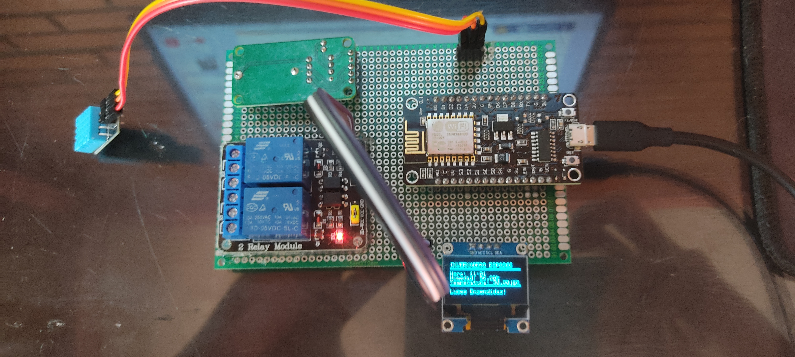

# Control de Invernadero con ESP8266
Este proyecto utiliza un ESP8266 para monitorear y controlar las condiciones ambientales de un invernadero, incluyendo la temperatura, la humedad y la iluminación. Se utiliza una pantalla OLED para mostrar los datos y se utilizan sensores DHT11 para medir la temperatura y la humedad.

## Características

- **Monitoreo de Temperatura y Humedad:** Utiliza un sensor DHT11 para medir la temperatura y la humedad del invernadero.

- **Interfaz de Usuario Clara:** Muestra los datos de temperatura, humedad y estado de las luces en una pantalla OLED para facilitar la visualización.

- **Seguimiento Preciso del Tiempo:** Utiliza un módulo RTC DS1302 para mantener un seguimiento preciso del tiempo, incluso en ausencia de conexión a internet.

## Instalación

1. Clona el repositorio a tu dispositivo local:

2. Abre el proyecto en Arduino IDE.

3. Conecta tu placa ESP8266 a tu computadora y carga el sketch.

## Librerías utilizadas
- **Wire.h:** Librería para la comunicación I2C.
- **Adafruit_GFX.h:** Librería para gráficos básicos.
- **Adafruit_SSD1306.h:** Librería para controlar la pantalla OLED SSD1306.
- **DHT.h:** Librería para trabajar con sensores de humedad y temperatura DHT.
- **ThreeWire.h y RtcDS1302.h:** Librerías para el manejo del módulo RTC DS1302.

## Conexiones

A continuación se detallan las conexiones necesarias para el proyecto, según lo definido en el código:

- **Sensor DHT11:** Conectar el pin de datos del sensor al pin D6 del ESP8266.

- **Relé 1:** Conectar el relé 1 al pin D7 del ESP8266.

- **Relé 2:** Conectar el relé 2 al pin D8 del ESP8266.

- **Pantalla OLED:** Conectar la pantalla OLED a los pines SDA y SCL del ESP8266 (usualmente D1 y D2, respectivamente).

- **Módulo RTC DS1302:** Conectar el módulo RTC a los pines IO, SCLK y CE del ESP8266 (usualmente D3, D5 y D4, respectivamente).

## Contribuciones

¡Las contribuciones son bienvenidas! Si te interesa contribuir al desarrollo de este proyecto, no dudes en enviar pull requests con mejoras, correcciones de errores o nuevas características. Tu ayuda es fundamental para hacer de este proyecto una herramienta aún más poderosa y útil para la comunidad.

## Licencia

Este proyecto está licenciado bajo la [Licencia MIT](LICENSE).
